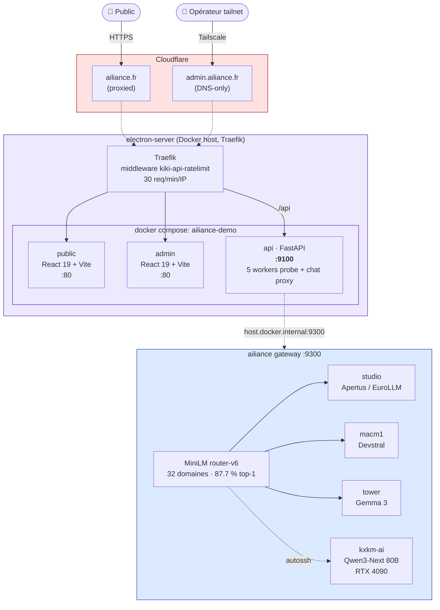
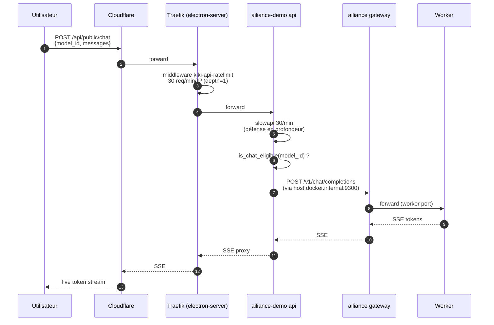
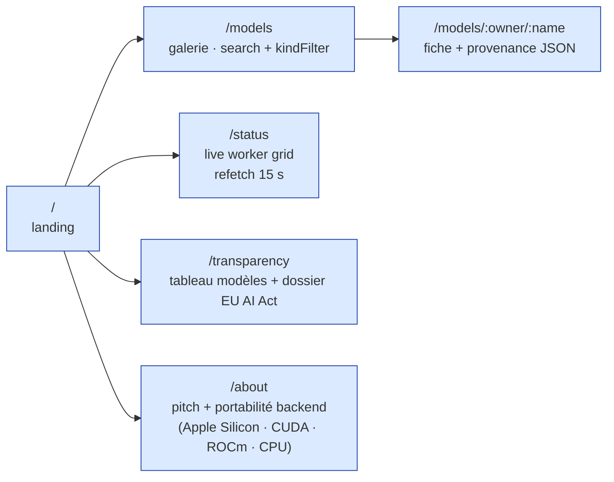
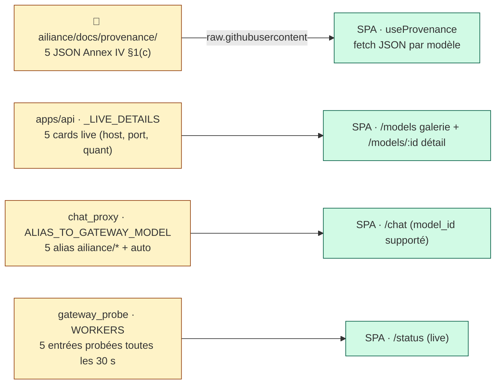

<div align="center">

# ailiance-demo

### Vitrine publique + console d'admin de la flotte LLM ailiance — 5 workers, provenance EU AI Act, chat live

[](https://ailiance.fr)
[](https://ailiance.fr/api/public/status)
[](LICENSE)
[](apps/api)
[](apps/cockpit-public)

**Public** → [`ailiance.fr`](https://ailiance.fr) · **Admin (Tailscale-only)** → [`admin.ailiance.fr`](https://admin.ailiance.fr) · **Status** → [`/api/public/status`](https://ailiance.fr/api/public/status)

</div>

---

## Ressources Ailiance

- **Demo live & cockpit**: https://www.ailiance.fr
- **Status dashboard**: https://home.saillant.cc
- **HuggingFace (IP source-of-truth)**: https://huggingface.co/electron-rare
- **HuggingFace (distribution produit)**: https://huggingface.co/Ailiance-fr
- **Validators audit-grade**: https://github.com/ailiance/iact-bench
- **Resultats bench**: https://github.com/ailiance/ailiance-bench

Ailiance est la pile de service LLM EU-souveraine de [L'Electron Rare](https://www.electron-rare.fr), PME francaise. Multi-modeles, audit-grade, transparence EU AI Act Art. 13/15/52/53.

## C'est quoi

Le front-end de la flotte LLM [ailiance](https://github.com/ailiance/ailiance). Deux applications, un seul backend FastAPI :

- **Vitrine publique** — galerie des modèles servis (5 workers ailiance + 24 modèles publiés sur HuggingFace), provenance EU AI Act inlinée par modèle, chat playground avec streaming SSE, page `/transparency`, page `/status` live.
- **Admin (Tailscale-only)** — monitoring des runs de training, santé workers, résultats d'éval, futurs sprints orchestration eval/train.

Une seule API FastAPI sert les deux frontends. Rate-limiting Traefik (30 req/min/IP) sur tout `/api`.

## Architecture



## Endpoints

### Publics (`/api/public/*`)

| Route | Effet |
|---|---|
| `GET /api/public/healthz` | liveness |
| `GET /api/public/models` | catalogue : 5 cards live ailiance + auto-router + ce qu'expose le HF cache (clemsail/*, electron-rare/*) |
| `GET /api/public/models/{owner}/{name}` | détail + provenance JSON inline |
| `GET /api/public/status` | santé live des 5 workers (cache 30 s) |
| `GET /api/public/router-stats` | métriques Prometheus du router (cache hits / misses, latence) |
| `POST /api/public/chat` | proxy SSE vers ailiance gateway, slowapi 30/min |

### Admin (`/api/admin/*`, Tailscale-only)

| Route | Effet |
|---|---|
| `GET /api/admin/workers/status` | ping de la liste `workers_to_check` (gateway + 5 workers) |
| `GET /api/admin/training-runs` | runs MLX-LM via collector :9150 (filesystem-on-studio shim) |
| `GET /api/admin/eval-runs` | catalogue eval, résultats agrégés |

Auth admin : header `X-Tailscale-User` injecté par Traefik (cf. [`apps/api/src/ailiance_demo/auth/tailscale.py`](apps/api/src/ailiance_demo/auth/tailscale.py)).

## Cycle d'une requête de chat



## Vitrine publique — pages



`React 19` + `Vite` + `TanStack Router` (file-based) + `TanStack Query` (cache 5 min sur les provenances, 10 s staleTime sur status).

## Stack technique

| Couche | Outil |
|---|---|
| **API** | FastAPI 0.118 + Pydantic v2 + uvicorn (Python 3.14, uv) |
| **Vitrine publique** | React 19 + Vite + TanStack Router + TanStack Query |
| **Admin** | React 19 + Vite + TanStack Router + auth Tailscale header |
| **Shared** | `@cockpit/shared` — types, UI primitives, hooks |
| **Tests api** | pytest + pytest-asyncio + httpx mock |
| **Tests SPA** | Vitest + React Testing Library |
| **Build & deploy** | `docker compose -f deploy/docker-compose.yml` derrière Traefik 3 (cert-resolver Let's Encrypt) |
| **Source d'observabilité workers** | probe HTTP direct vers `studio:9301`, `macm1:9302`, `studio:9303`, `tower:9304`, `host.docker.internal:8002` (qwen via tunnel autossh) |

## Sources de vérité



Quand on ajoute / retire un modèle servi, **les 4 listes doivent bouger ensemble** (test `test_workers_constant_matches_production_fleet` enforce que `WORKERS` correspond bien à la production).

## Démarrage rapide (dev)

```bash
git clone https://github.com/ailiance/ailiance-demo.git
cd ailiance-demo
pnpm install
uv sync
pnpm dev          # boots api + public + admin en parallèle
```

Tests :

```bash
# API
cd apps/api && uv run pytest tests/ -q

# SPA
cd apps/cockpit-public && pnpm test
cd apps/cockpit-admin && pnpm test
```

## Déploiement

```bash
# depuis electron-server, /opt/ailiance-demo
git pull --ff-only
docker compose -f deploy/docker-compose.yml --env-file deploy/.env up -d --build api public admin
```

Le `docker-compose.yml` déclare les routers Traefik (`kiki-api-public`, `kiki-api-admin`, `kiki-public`, `kiki-admin`) et la middleware `kiki-api-ratelimit`. Cert-resolver `letsencrypt`. Réseau externe `traefik` requis (Traefik 3 déjà running sur l'host).

## Variables d'environnement

| Clef | Effet | Défaut |
|---|---|---|
| `COCKPIT_HOST` / `COCKPIT_PORT` | bind FastAPI | `0.0.0.0:9100` |
| `COCKPIT_LOG_LEVEL` | niveau de log uvicorn | `INFO` |
| `COCKPIT_AILIANCE_GATEWAY_URL` | passerelle ailiance | `http://host.docker.internal:9300` |
| `COCKPIT_HF_TOKEN` | jeton HF pour `hf_cache` | (vide → unauthenticated) |
| `COCKPIT_TRAINING_LOG_ROOTS` | racines filesystem direct | `[]` (utilise collector) |
| `COCKPIT_COLLECTOR_BASE_URL` | shim filesystem-on-studio | `http://studio:9150` |

## Layout monorepo

```
ailiance-demo/
├── apps/
│   ├── api/                       FastAPI service
│   │   └── src/ailiance_demo/
│   │       ├── routers/
│   │       │   ├── public/        models, chat, status, healthz
│   │       │   └── admin/         workers, training, eval (Tailscale auth)
│   │       └── services/
│   │           ├── chat_proxy.py        ALIAS_TO_GATEWAY_MODEL
│   │           ├── gateway_probe.py     WORKERS list + probe + cache 30s
│   │           ├── hf_cache.py          HF Hub mirror
│   │           └── eval_index.py        eval results catalogue
│   ├── cockpit-public/            React 19 vitrine
│   │   └── src/
│   │       ├── routes/            file-based TanStack Router
│   │       ├── hooks/             useStatus, useProvenance, useModels…
│   │       └── components/layout/ Header, Footer
│   └── cockpit-admin/             React 19 admin (Tailscale-only)
├── packages/shared/               @cockpit/shared (types, UI primitives)
└── deploy/
    └── docker-compose.yml         Traefik labels, rate-limit middleware
```

## Tests verts (2026-05-06)

```bash
cd apps/api && uv run pytest tests/integration/test_status_endpoint.py \
                              tests/integration/test_models_endpoint.py \
                              tests/integration/test_workers_endpoint.py
# 7 passed
```

`test_workers_constant_matches_production_fleet` est le canari : il échoue si on retire un alias ailiance/* sans aussi mettre à jour `WORKERS`.

## Sister projects

- [`ailiance`](https://github.com/ailiance/ailiance) — la passerelle LLM elle-même (workers, router-v6, dossier EU AI Act).
- [`agent-kiki`](https://github.com/ailiance/ailiance-agent) — agent de code (CLI `aki` + extension VS Code) qui pointe sur cette passerelle par défaut.

## Licence

Apache-2.0.

---

<div align="center">
<sub>Built in France 🇫🇷 · No cloud · Apache-2.0 · <a href="https://ailiance.fr">ailiance.fr</a></sub>
</div>
